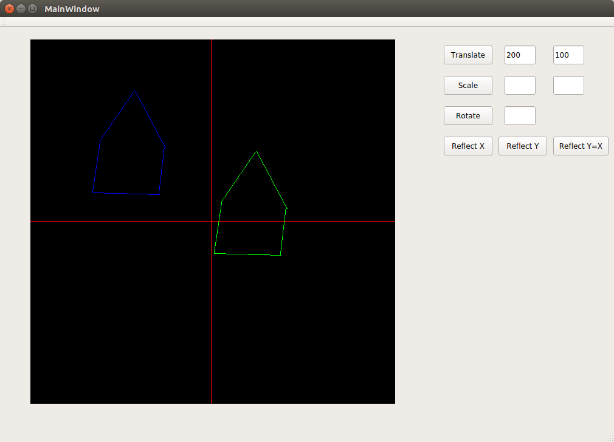
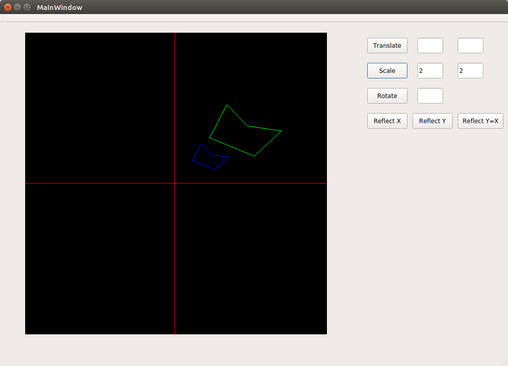
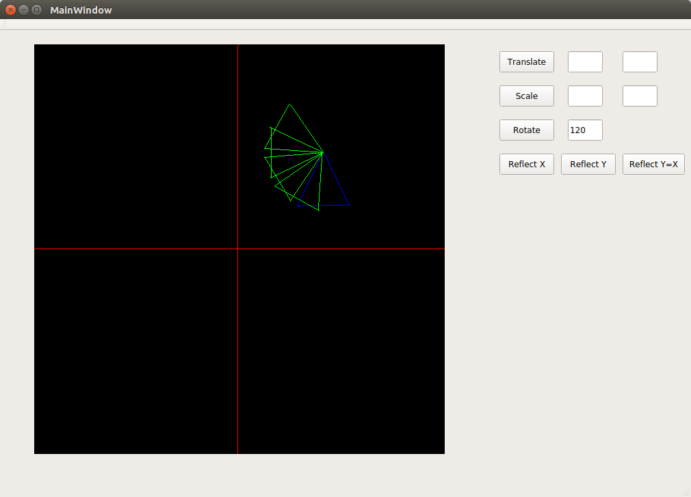
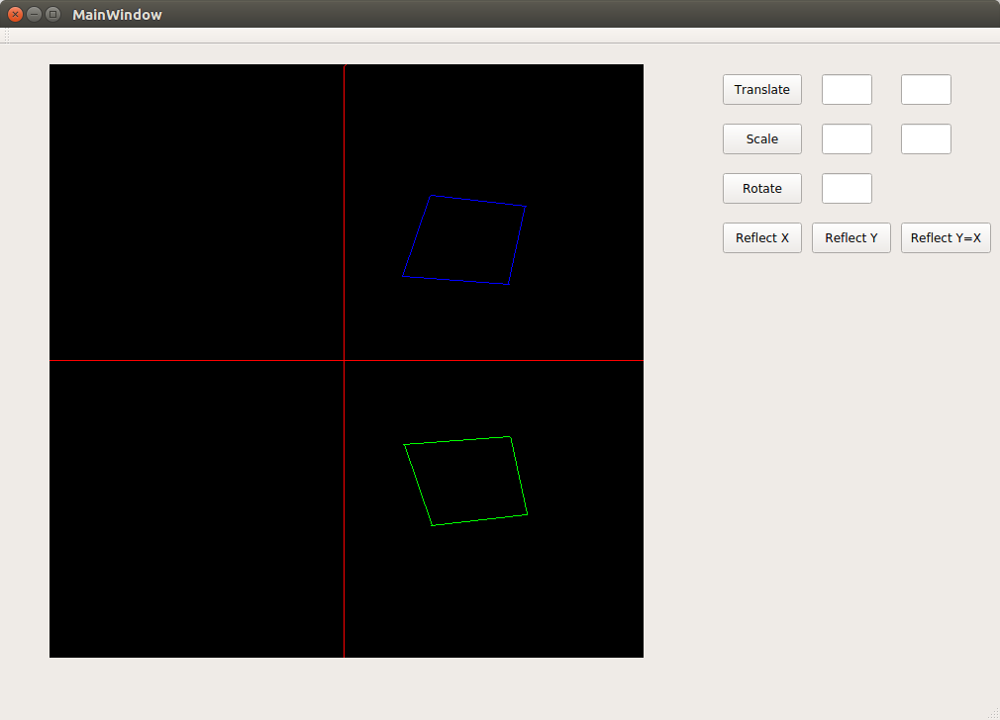
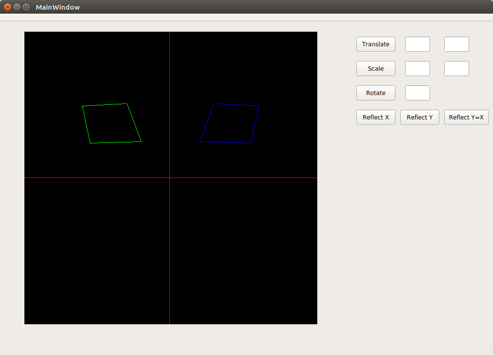
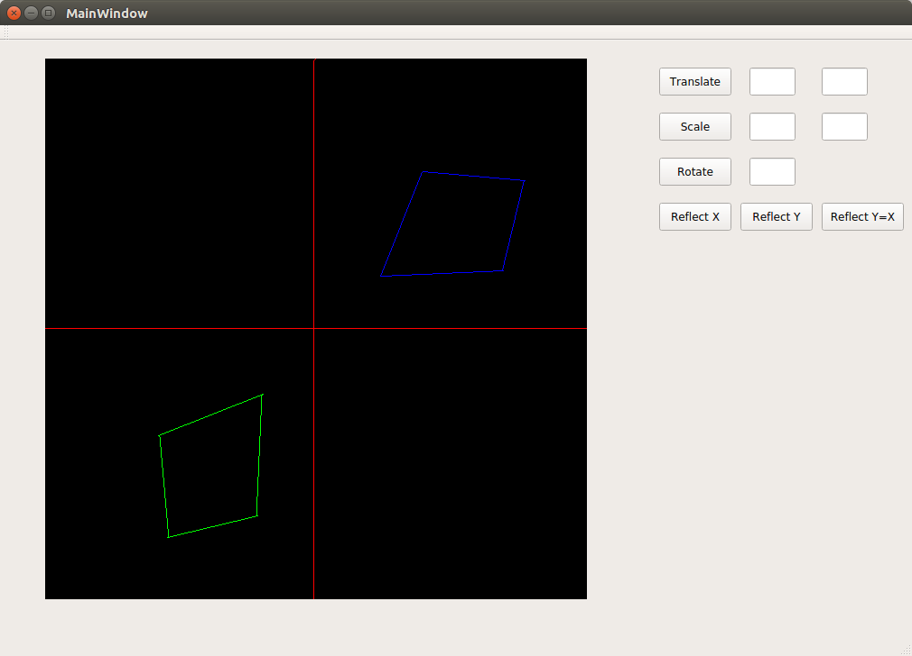

## 2D Transformations
###### Following transformations are performed :
1. Translation
1. Scaling
1. Rotation (Clockwise)
1. Reflection about X-axis
1. Reflection about Y-axis
1. Reflection about Y=X line

#### Output
|Translation                 |Scaling                     |
|----------------------------|----------------------------|
|||
|----------------------------|----------------------------|
|Rotation (Clockwise)        |Reflection about X-axis     |
|----------------------------|----------------------------|
|||
|----------------------------|----------------------------|
|Reflection about Y-axis     |Reflection about Y=X line   |
|----------------------------|----------------------------|
|||
|----------------------------|----------------------------|