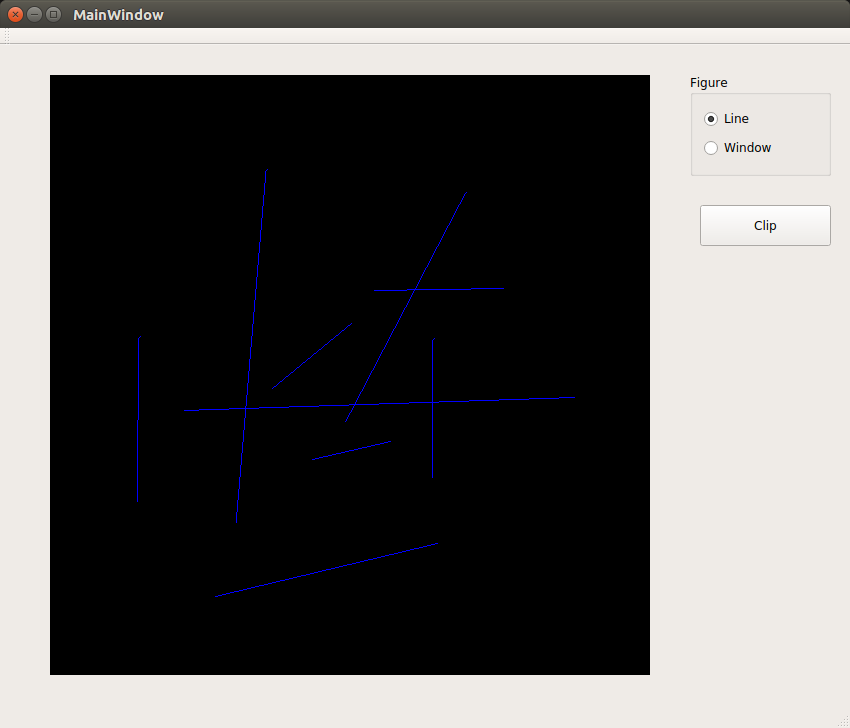
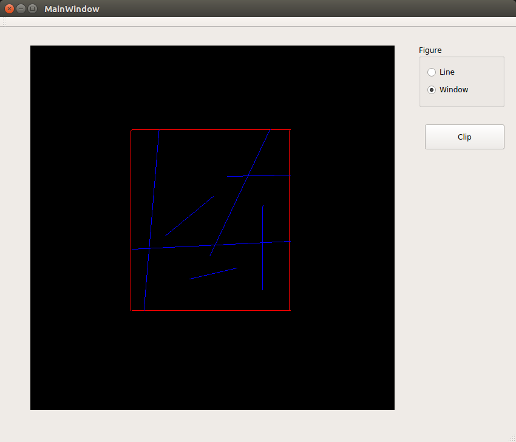

## 2D Line Clipping
#### Cohen sutherland algorithm
1. Mouse interfacing is used for line drawing and window drawing
1. Cohen sutherland algorithm is used to clip each line based on three cases
	1. if outcode of both endpoints is zero - Fully visible
	1. if result of AND operation is non-zero - Fully invisible
	1. if result of AND operation is zero - Finding intersection points with window
#### Output
|||
|-------------------------|-------------------------|
||
