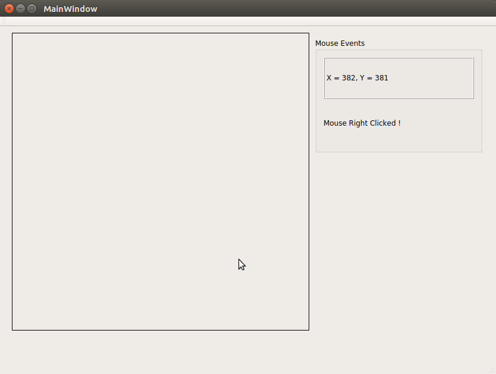
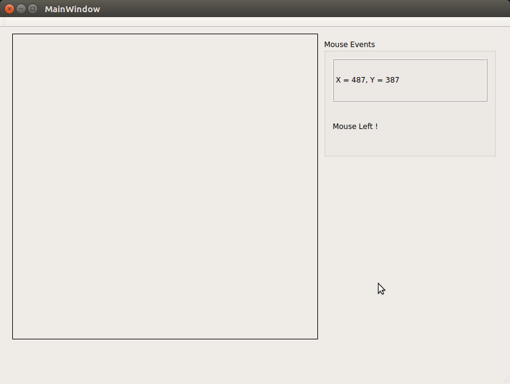

## Mouse Interfacing
###### Mouse events handled are :
1. mouseMoveEvent  (QMouseEvent)
1. mousePressEvent (QMouseEvent)
1. leaveEvent      (QEvent)

#### Output
 | 
-------------------------------------------------------------- | --------------------------------------------------------------
 | 
 
