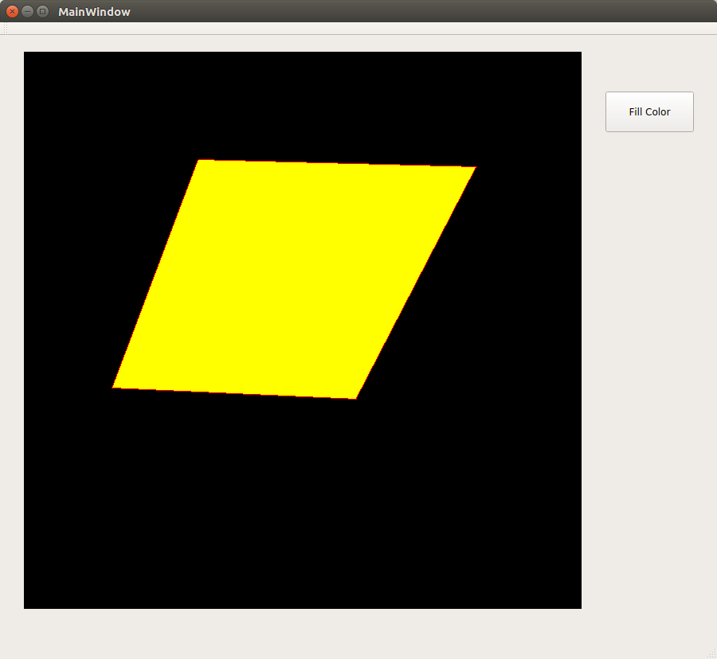

## Seed fill and polygon drawing
#### Flood fill using
1. Mouse interfacing
1. Bresenham Line Generation algorithm
1. QColorDialog

#### Output
|||
|---------------------------|---------------------------|
